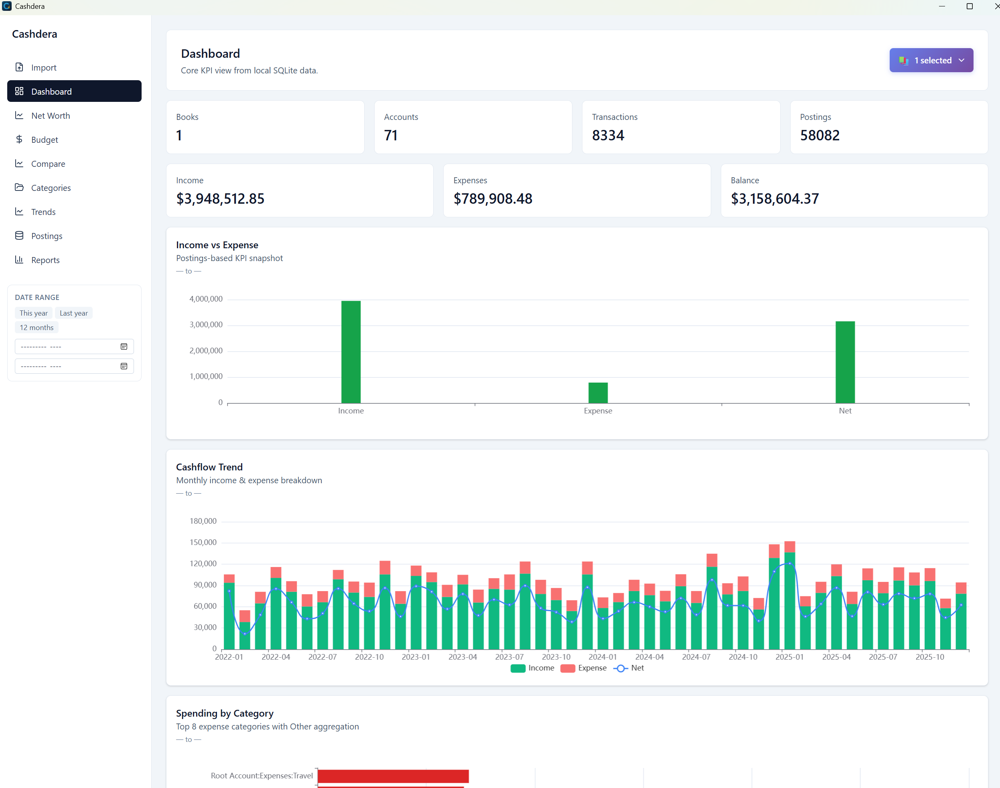
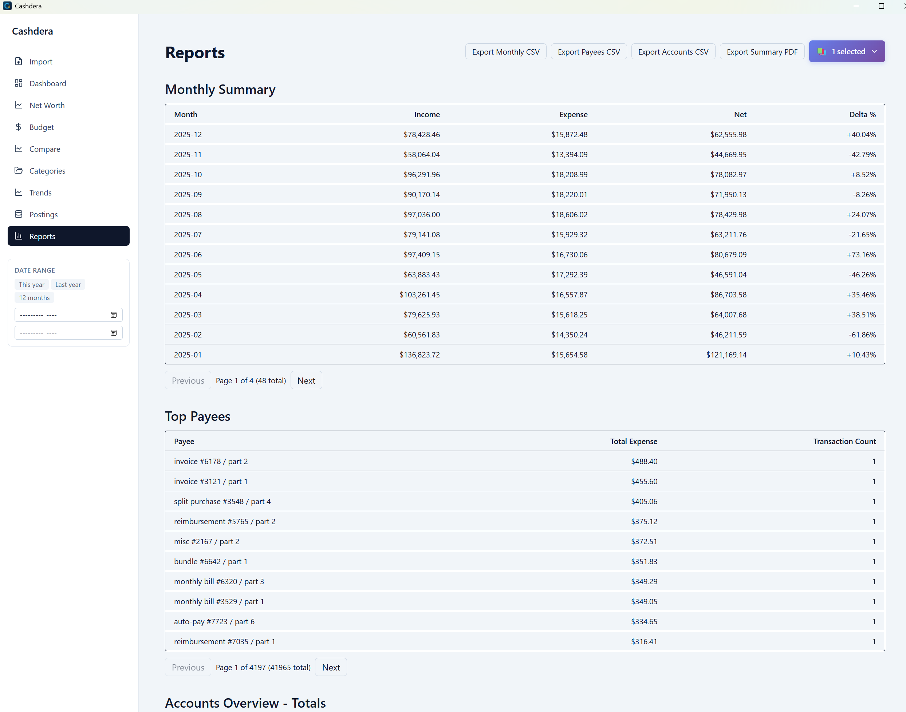
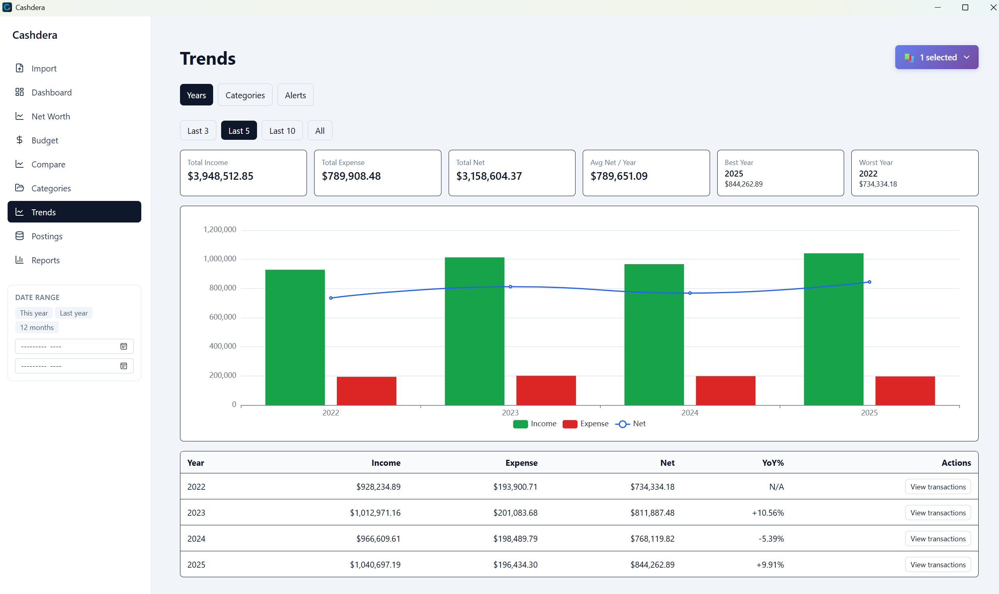
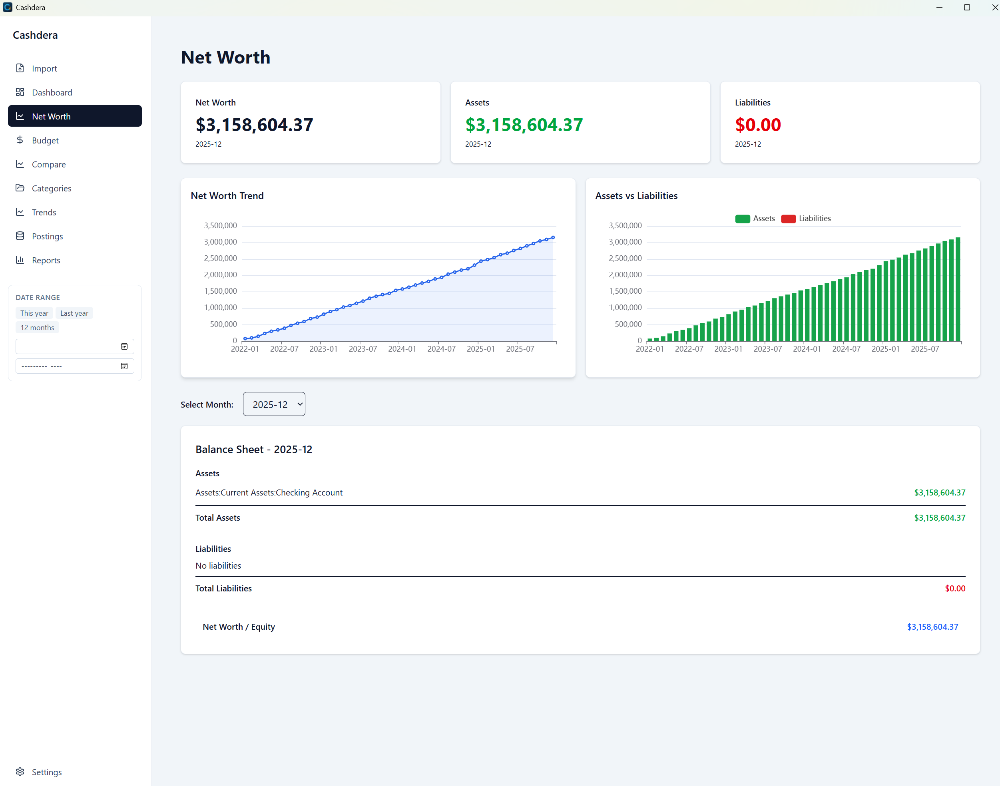
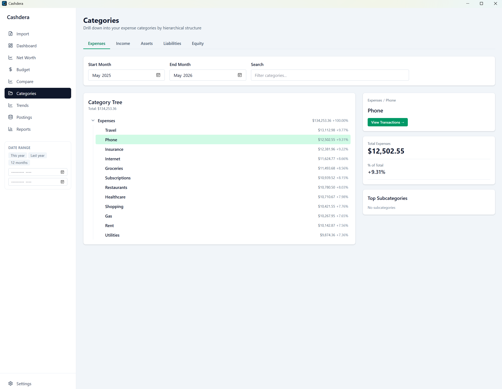
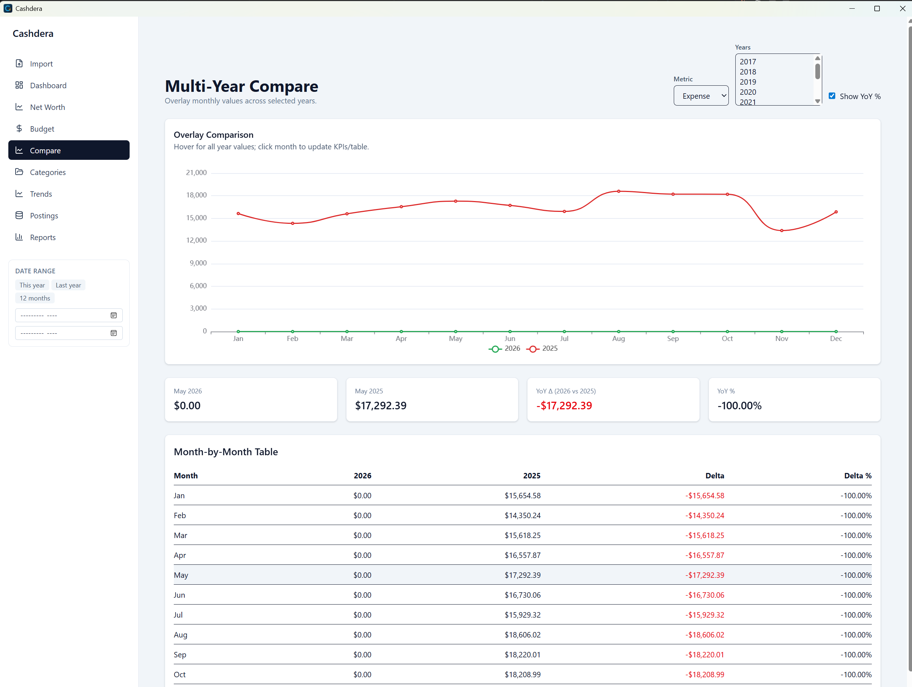
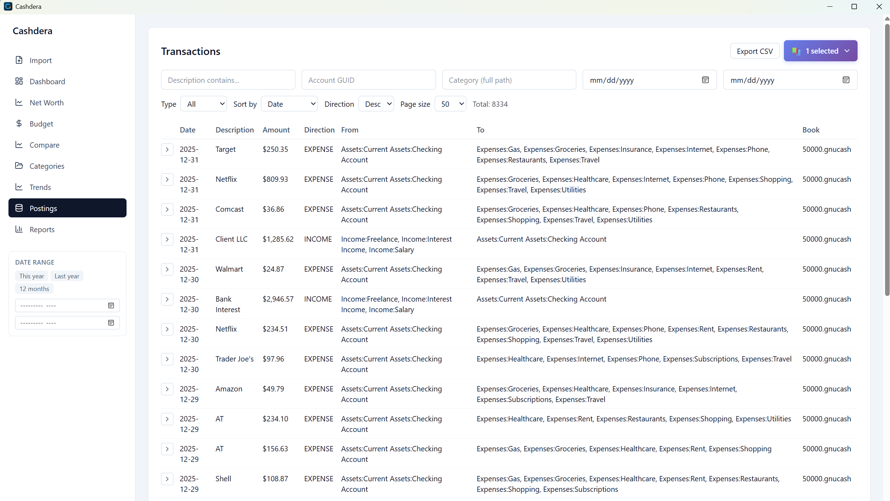

# Cashdera

**Free local-first GnuCash analytics — [cashdera.com](https://cashdera.com/)**

[](https://cashdera.com/)
[](https://github.com/proars/Cashdera/releases/latest)
[](https://cashdera.com/download.html)

**GnuCash is great for bookkeeping. Analytics? Not so much.**

Cashdera opens your `.gnucash` file and turns it into dashboards, spending trends, and net worth reports — all running locally on your desktop. No cloud. No account. No subscription. Your data never leaves your computer.

> **First Public Release** — free to download and use. Report bugs and ideas via [GitHub Issues](https://github.com/proars/Cashdera/issues).

---

## Download

**[Download latest release →](https://github.com/proars/Cashdera/releases/latest)**

**v1.1.0** (latest):

- Windows installers: `Cashdera_1.1.0_x64-setup.exe`, `Cashdera_1.1.0_x64_en-US.msi`
- macOS: universal binary (`.dmg` installer)
- Linux: `Cashdera_1.1.0_x64.deb`, `Cashdera_1.1.0_x64.rpm`, `Cashdera_1.1.0_x64.AppImage`
- `checksums.txt` — SHA256 hashes for verification

See also: **[Changelog](CHANGELOG.md)** and **[Release Notes](../RELEASE_NOTES.md)** for version-to-version changes.

No dependencies. Just install and open your `.gnucash` file.

---

## Try it without your own data

A sample file is included in this repository: **`demo.gnucash`**

It contains ~20 accounts and 22 transactions (USD, Dec 2024 – May 2026) — enough to explore every page in Cashdera without connecting your real finances.

1. Download or clone this repo so you have `demo.gnucash` locally.
2. Open Cashdera and click **Import**.
3. Select `demo.gnucash` — it loads in seconds.

> **Windows SmartScreen warning?** Windows installer may be unsigned. Click "More info → Run anyway." Each release includes `checksums.txt` with SHA256 hashes — see [Verify release checksums](#verify-release-checksums).

---

## What Cashdera gives you

| Dashboard | Money Flow |
| --------- | ---------- |
|  |  |

| Reports | Trends | Net Worth |
| ------- | ------ | --------- |
|  |  |  |

| Categories | Multi-Year Compare | Transactions |
| ---------- | ------------------ | ------------ |
|  |  |  |

### Dashboard — the full picture in seconds

Monthly cash flow chart, expenses by category, key metrics (income, expenses, balance, accounts, transactions, postings) — all at a glance. Account count excludes the technical root container from GnuCash. A separate **Money Flow** tab loads the Sankey diagram on demand, showing where money came from and where it went with three levels of detail: Compact, Balanced, Detailed. In Detailed mode, the diagram is still aggregated for readability, so node count can be lower than the Dashboard Accounts metric. Date Range is off by default after app launch, so pages start with all available data until you choose a range.

### Transactions — actually searchable

Full-text search across all memos and descriptions. Filter by category, account, or direction (income / expense). Expandable split rows to see how a transaction breaks down across accounts. Pagination (25 / 50 / 100 per page). Export to CSV or XLSX with all active filters applied.

### Reports — ready to share

- **Monthly summary** — income, expenses, net result with % change vs. previous month
- **Top payees** — who you pay the most, with amounts and transaction counts
- **Accounts overview** — current and previous balances by group and individual account

Export any report table to **CSV** or **XLSX**. Export the full summary to **PDF** or a multi-sheet **XLSX** workbook.

### Trends — spot patterns across years

Year-over-year comparison on a single chart. Select a specific category or top-N by spend. Stacked bars for category comparison by year. And automatic **spending anomaly alerts** — three levels (info / warning / critical) that flag categories spiking above your personal historical average, including new categories you've never spent in before.

### Net Worth — assets and liabilities over time

Monthly timeline with stacked asset vs. liability bars. Balance sheet snapshot for any selected month. Per-account drilldown: click any account to see its balance trend over time.

### Year Comparison — Jan–Dec across multiple years

Overlay up to 10 years on one chart. Metric selector: income, expenses, net result, or category spend. Optional YoY% toggle. 12-row monthly comparison table synced with the chart.

### Categories — deep expense breakdown

Hierarchical category tree up to 3 levels with rolled-up parent totals. Search with instant results. Each category's share of total expenses. Expandable subcategories with improved tree navigation. Filter by date range.

### Current book workflow

Import and store multiple GnuCash books, then choose one current book for analysis. Dashboard, transactions, reports, net worth, and categories all read from that current book. Mixed-currency books show an explicit warning instead of silently summing across currencies.

---

## Export summary

| What | Format |
| ---- | ------ |
| Transactions (with active filters) | CSV, XLSX |
| Monthly summary | CSV, XLSX |
| Top payees | CSV, XLSX |
| Accounts overview | CSV, XLSX |
| Full financial summary | PDF, XLSX (multi-sheet) |

---

## How it works

1. **Open Cashdera** — no sign-in, no setup wizard
2. **Import your `.gnucash` file** — plain XML and gzip-compressed both work; format detected automatically
3. **Explore your data** — all pages load instantly

Import runs in the background with a progress indicator. Cancel at any time. After a successful import or re-import, Cashdera automatically switches the app to that book. Re-import results are tied to the active background job, so the confirmation belongs to the file you just refreshed. Cashdera keeps an import history and adds a **"file changed" badge** when your source `.gnucash` file is updated — one click to re-import without finding the file again. You can also delete a local import from the Recent imports list; this removes Cashdera's local copy and history, not your original `.gnucash` file.

Heavy computations run once at import and are stored in local SQLite cache tables. Page switches are instant even on books with 100k+ transactions.

---

## Settings

- **Theme** — light, dark, or system default
- **Timezone** — auto-detect or manual selection from 25+ IANA zones (affects date grouping in all reports)
- **Diagnostics** — About page can copy diagnostics text and export a ZIP with runtime error logs and recent import/job context
- **Desktop UI behavior** — native browser right-click context menu is disabled across the app

---

## Privacy

- Cashdera runs entirely on your device.
- Your GnuCash files and imported data are **not uploaded anywhere**.
- Imported data is stored in SQLite files in your OS application data directory — you own them.
- Deleting an import removes Cashdera's local imported copy and history. It does not delete your original GnuCash file.
- No analytics, no telemetry, no crash reporting sent to any server.

---

## Before using with real data

- Work from a **copy or backup** of your `.gnucash` file.
- Verify reports and totals before making financial decisions based on them.
- Treat Cashdera as an analytics companion, not a replacement for your GnuCash records.

---

## Verify release checksums

```powershell
Get-FileHash .\Cashdera_1.1.0_x64-setup.exe -Algorithm SHA256

```

Compare the output with the matching line in `checksums.txt` from the same release.

---

## Feedback

Found a bug? Have a feature request? Something confusing?

**[Open a GitHub Issue](https://github.com/proars/Cashdera/issues/new)** — that's the fastest way to reach me.

Questions that help the most:

- What did you expect vs. what happened?
- Which GnuCash workflows does Cashdera not cover for you?
- What would make you recommend this to another GnuCash user?

Please don't attach original `.gnucash` files or real financial data to public issues.

---

## Legal

Cashdera is independent software. It is not affiliated with, sponsored by, or endorsed by the GnuCash project.

- `EULA.txt` — license terms
- `PRIVACY.md` — privacy details
- `THIRD_PARTY_NOTICES.txt` — open source components used
